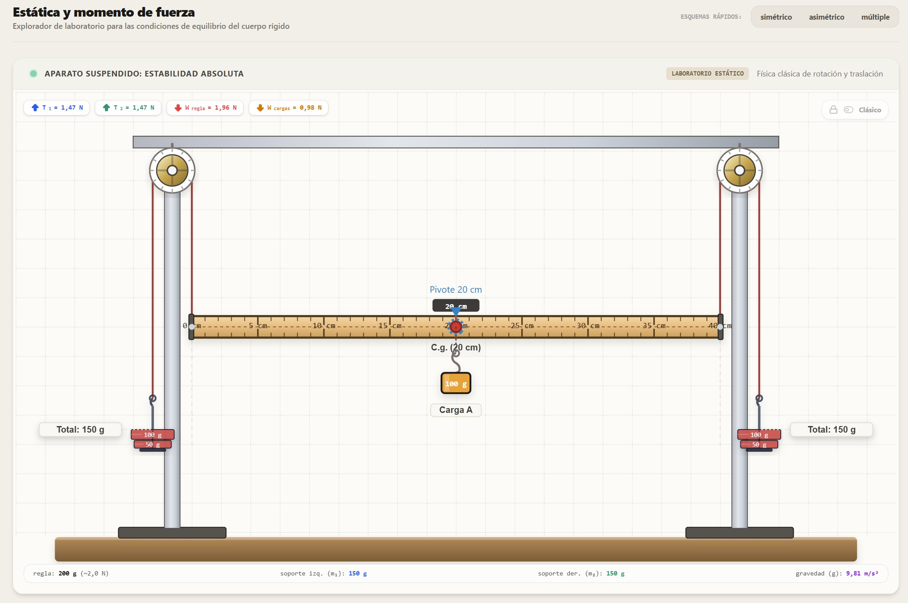

# Static Equilibrium Simulator

An interactive **Scholar Lab** project for exploring the conditions of static equilibrium through forces, moments, movable loads, free-body diagrams, and guided challenges.



## What it includes

- Real-time translational and rotational equilibrium calculations
- Adjustable support masses, ruler mass, load positions, gravity, and pivot
- CGS and SI unit views
- Free-body diagrams and torque breakdowns
- Classic and schematic visualization modes
- Guided static-equilibrium challenges for students

## Run locally

```bash
npm install
npm run dev
```

The development server runs at `http://localhost:3000`.

## Build

```bash
npm run build
```

## Stack

React, TypeScript, Vite, Tailwind CSS, and Lucide icons.

---

Educational project focused on making introductory statics and rigid-body equilibrium easier to explore visually.
